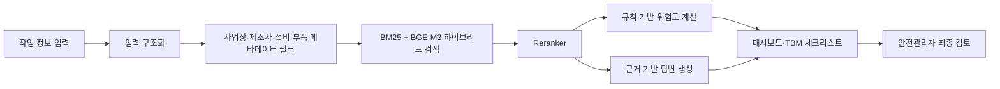

# SafeMaint AI 초기 아키텍처

## 설계 원칙

1. AI는 안전을 보장하거나 작업을 승인하지 않습니다.
2. 위험등급은 LLM의 자유 생성이 아니라 규칙 엔진에서 계산합니다.
3. 검색 근거가 없으면 임의의 규정이나 출처를 만들지 않습니다.
4. 공통 안전자료, 제조사 자료, 사업장 자료, 운영 이력을 분리합니다.
5. 검색 품질을 먼저 검증하고 사진·GPS·파인튜닝은 후순위로 둡니다.

## 목표 흐름

현재 코드에서는 `입력 → 규칙 기반 평가 → 트랜잭션 저장 → DB 대시보드`까지 구현되어 있습니다. 하이브리드 검색은 `RetrievalService` 인터페이스 뒤에 연결하도록 분리했습니다.

## 데이터 계층

| 계층 | 예시 | 공개 저장소 정책 |
|---|---|---|
| 공통 데이터 | KOSHA GUIDE, 법령, 산업재해 사례 | 이용조건 확인 후 원문 링크와 메타데이터 위주 저장 |
| 제조사 데이터 | 카탈로그, 부품 매뉴얼 | 재배포 조건 확인, 제한 자료는 Git에 저장하지 않음 |
| 사업장 데이터 | 안전규정, 설비 목록, 작업표준서 | 비공개 저장소 또는 별도 스토리지 사용 |
| 운영 데이터 | 점검 결과, 체크리스트 완료 기록 | 개인정보·사업장 식별정보 최소화 |

## 다음 구현 순서

1. 컨베이어와 대표 작업에 대한 데이터 범위 확정
2. 확정된 입력 규격으로 문서 로딩·청킹 파이프라인 구현
3. BM25와 BGE-M3 검색 결과를 RRF로 병합
4. Reranker 적용 및 Golden Set 30~50개 평가
5. 근거 인용이 포함된 파운데이션 모델 답변 연결
6. 승인 상태 변경과 역할별 대시보드 확장
